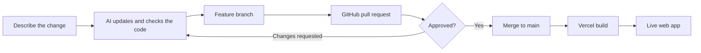

# Baseline for Coding Demo

A small, dependency-free Hello World application that demonstrates how an idea can move from an AI-assisted code change to a reviewed GitHub pull request and then to a live Vercel deployment.

## Delivery flow



The AI coding agent works in a feature branch and updates the repository files. The branch is pushed to GitHub as a pull request so a person can review and approve it. Once merged into `main`, Vercel runs `npm run build`, publishes the `dist` directory, and serves the resulting application at the configured Vercel URL.

## How Hello World works

1. `index.html` provides the browser page and an empty `<div id="root"></div>` mount point.
2. `src/main.ts` finds that mount point and inserts an `<h1>Hello World</h1>` heading.
3. `src/styles.css` centres the heading and supplies the page styling.
4. `scripts/build.mjs` recreates `dist`, produces `dist/main.js`, copies the stylesheet, and rewrites the HTML asset paths for deployment.
5. `vercel.json` tells Vercel to run the build, publish `dist`, and route requests back to the application entry page.

## Baseline version

This clean starting point is version **1.0.0** and is identified by the Git tag:

```text
coding-demo-baseline-v1.0.0
```

### Return to the v1.0.0 baseline

First, fetch the tag from GitHub:

```powershell
git fetch --tags
```

To inspect or run v1.0.0 without changing the current codebase, create a temporary branch directly from the tag:

```powershell
git switch -c inspect/coding-demo-baseline coding-demo-baseline-v1.0.0
```

To roll the codebase back through the normal review process, start with a clean and up-to-date `main`, create a rollback branch, and revert every commit made after the baseline:

```powershell
git switch main
git pull --ff-only
git switch -c restore/coding-demo-baseline-v1.0.0
git revert --no-commit coding-demo-baseline-v1.0.0..HEAD
git commit -m "Restore coding demo baseline v1.0.0"
git push -u origin restore/coding-demo-baseline-v1.0.0
```

Create a pull request from `restore/coding-demo-baseline-v1.0.0` into `main`. After approval and merge, Vercel will deploy the restored Hello World baseline. This approach preserves the repository history; do not force-push or move `main` back to the tag.

Future changes should increment the version in `package.json` and create a new baseline tag only when a new clean recovery point is intentionally established. Tags should not be moved or reused, which keeps this exact Hello World state recoverable.

## Commands

- `npm run dev` serves the project locally at <http://localhost:5173>.
- `npm run build` compiles the application into `dist`.
- `npm run preview` serves the production build at <http://localhost:4173>.
